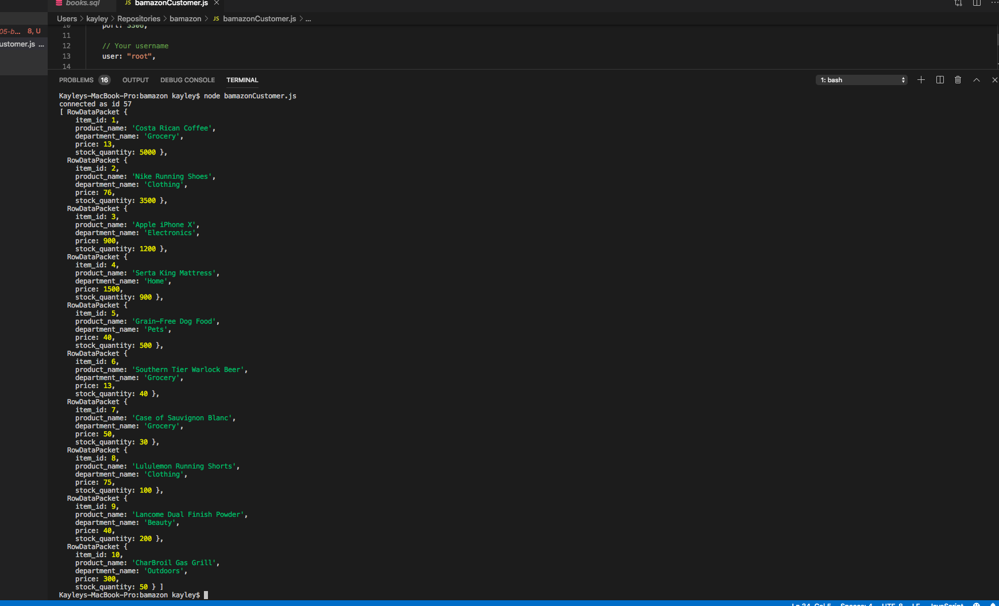
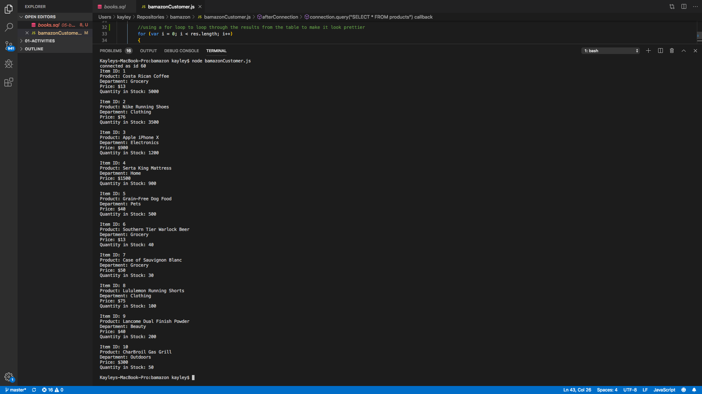
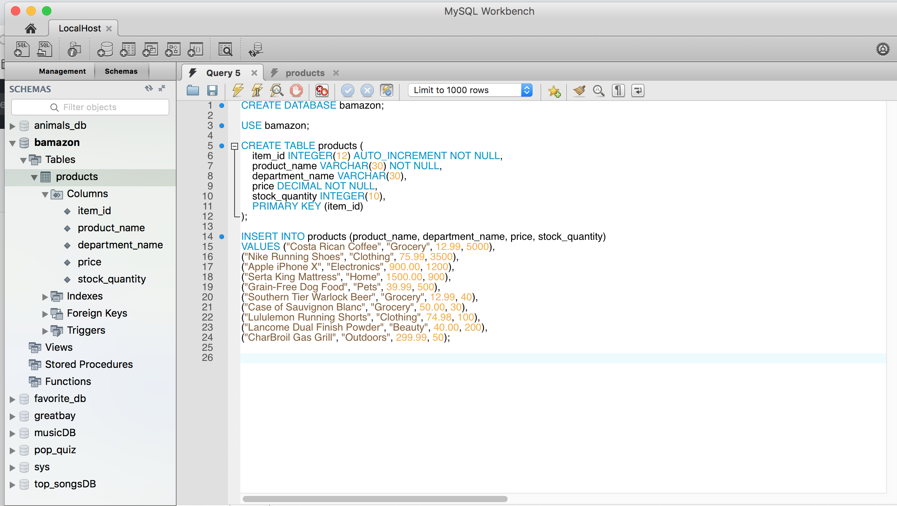
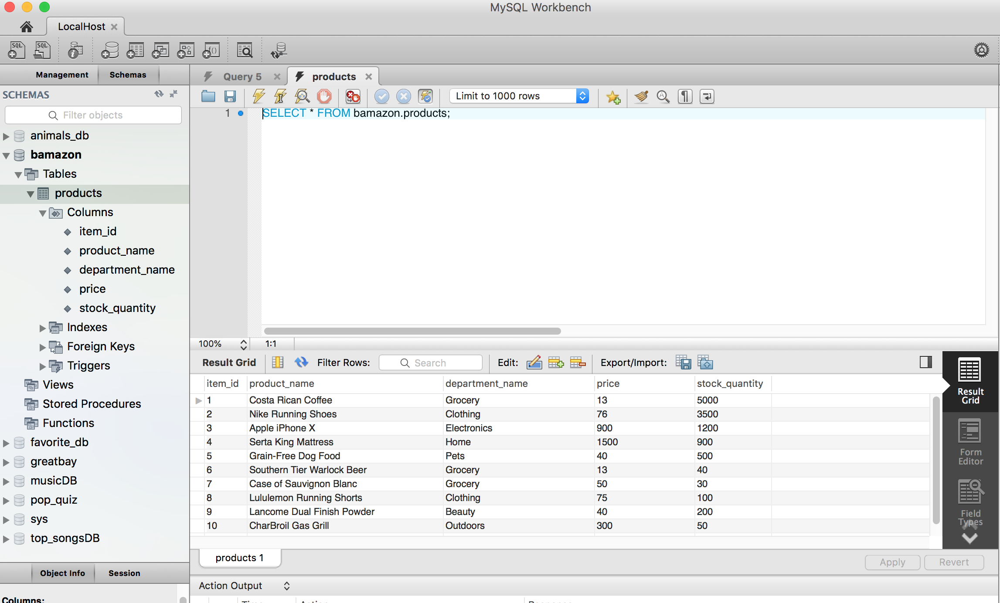

# bamazon
This repo is for Week 12 Homework. Bamazon will use mySQL, Node, and JavaScript

*[GitHub Repo Link](https://github.com/kayleybannister/bamazon)

All Results Displayed in Terminal

All Results with JS For Loop

SQL Schema in mySQL

SQL Table in mySQL

** all screenshots are saved in the GitHub repository readMe file
